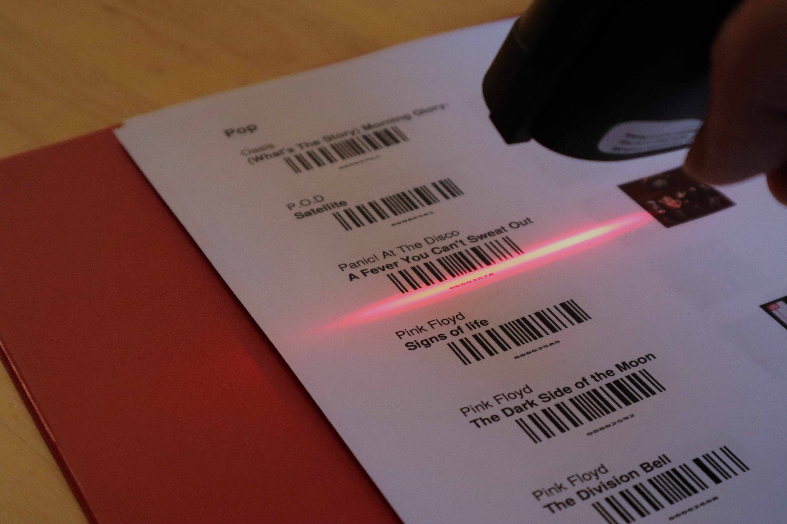

# Musicbox
This is my raspberry pi musicbox. It allows me to play my local music (e.g. mp3s) on a bluetooth speaker by scanning a barcode in a physical binder of my music. As a backup, there is a web interface. I give some color commentary in my [blog post](https://www.bradsaund.com/post/music_box/).

This musicbox is built on mopidy, and therefore could be adapted to all of the mopdiy plugins and websites. 

If you run into problems, or want more detail, please create an issue.

# Setup
## Overview
1. [Set up raspbian](#set-up-raspbian)
2. [Install mopidy](#install-mopidy)
3. [Resolve issues](#resolve-issues)
4. [Set up custom code](#set-up-custom-code) for the barcode reader and for reacting to the bluetooth remote

## Set up raspbian
- Install raspbian using the [image writer utility](https://www.raspberrypi.org/blog/raspberry-pi-imager-imaging-utility/). 
- Boot into raspbian. For convenience, enable ssh and VNC in the `Raspberry Pi Configuration` using the main system menu. You can then use Remmina from ubuntu to remote-desktop into the pi.
- [Optional] Set a static IP for the raspberry pi in your router.
- Connect to your bluetooth speakers, play some test sounds.

## Install mopidy
- Follow the [mopidy install instructions for raspian](https://docs.mopidy.com/en/latest/installation/raspberrypi/#how-to-for-raspbian). Be sure to `sudo adduser mopidy` to `audio` and `bluetooth` groups
- [Enable mopidy as a system.d service](https://docs.mopidy.com/en/latest/running/service/#service-management-with-systemd)

## Resolve issues
I had issues making my bluetooth speaker connect nicely. When run as a service mopidy sound would not play over bluetooth.
I followed [this link](https://docs.mopidy.com/en/latest/running/service/?highlight=pulseaudio#system-service-and-pulseaudio)

Also, my bluetooth speaker regularly disconnects. To make sure the raspberry pi connects whenever the bluetooth speaker becomes available I followed [this issue](https://github.com/manjaro/packages-extra/issues/64 ) and
- Added `load-module module-switch-on-connect` to `/etc/pulse/default.pa` to autoconnect to bluetooth as the speaker turns off and on:

## Set up custom code
- Add the `systemd` service files to `/lib/systemd/system/`
- `sudo pip3 install` all needed packages. You must `sudo` if using the `systemd` service that runs as root. (TODO: Compile a list. You can figure it out though). 
- `sudo systemctl enable musicbox-bluetooth.service`
- `sudo systemctl enable musicbox-scanner.service`
- For more information on [systemd](https://tecadmin.net/setup-autorun-python-script-using-systemd/)

### Add the bluetooth remote controller listener
The `code/bluetooth_control.py` _should_ already work nicely with any remote control. To create this script, I learned from these links:
https://thehackerdiary.wordpress.com/2017/04/21/exploring-devinput-1/
https://stackoverflow.com/questions/54745576/detecting-the-buttons-on-a-bluetooth-remote-hid-over-gatt

### Add barcode scanner
- Connect the barcode scanner and look at the path created on the raspberry pi under `/dev/input/by-id/`
- Edit the path in `code/barcode_player` 
- I already had permissions, but if you run into permissions issues check out the udev rules:
- SUBSYSTEM=="usb", ATTR{idVendor}=="28e9", ATTR{idProduct}=="28e9", MODE="0666"
- `udevadm control --reload`

### Add Dropbox sync
- Add any mp3 files to `/home/pi/Dropbox/Music` (note: any filepath works, though you'll need to change the python scripts). Group the music by `category/band/song.mp3`. You can also create deeper nested files (e.g. `/Pop/The White Stripes/Elephant/songs.mp3`), but at least `category/band` is expected.
- Optionally sync with Dropbox with `rclone`: https://www.thedigitalpictureframe.com/how-to-finally-access-dropbox-on-your-raspberry-pi-using-rclone/
- Optionall set up a cron job to periodically sync.

# Generate your directory
Check out the `img` folder for an example directory.

- On a computer with your music (not necessarily the raspberry pi), edit the `BASE_FP` filepath in `code/barcode_map.py`
- Run `python3 barcode_map.py`
- A pdf with your music is created. Print this out double-sided.
- Copy the `.barcode_config` file to the raspberry pi (happens automatically if using dropbox sync)
- Restart the barcode scanner service `sudo systemctl restart musicbox-scanner.service` (or just restart the pi)
- Scan a barcode. The corresponding album should be playing on the bluetooth speaker.

